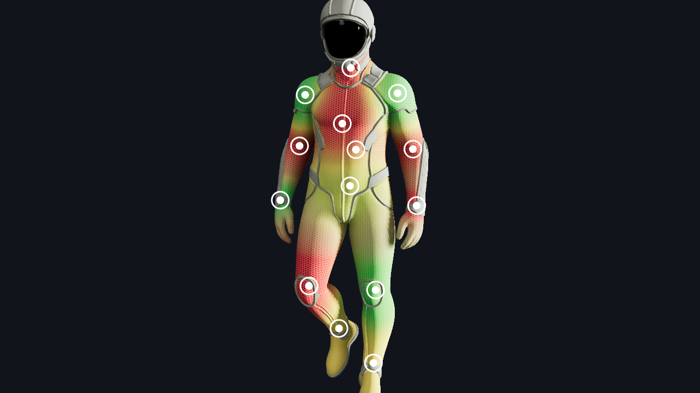

# 3D viewer + dynamic heatmap

A web viewer for a 3D character with a heatmap layer computed **in the shader**,
underneath the armor, plus an editor for placing and tuning the hot spots.



Porting just the effect into another app? See **[INTEGRATION.md](INTEGRATION.md)** —
the layer is two DOM-free files, none of the editor is needed.

```bash
npm install
npm run dev      # http://localhost:5187
npm run build    # produces dist/, ready to deploy
```

## How to use it

| Action | How |
| --- | --- |
| Add a heat point | Click the model |
| Select a point | Click its ring |
| Delete a point | Shift + click the ring, or the ✕ in the list |
| Duplicate the selected point | Ctrl+D, or the `Duplicate` button |
| Orbit / zoom / pan | Drag / wheel / right button |

The selected point shows a cyan wireframe that is its real influence volume: handy
to see exactly how far it reaches while moving the size slider.

To adjust it after placing it there are per axis sliders (X left/right, Y down/up,
Z back/front), with the range taken from the model's bounding box. Arrow keys move
it too: **Shift** switches to the Z axis, **Alt** makes the step five times finer.
If a panel control has focus, the arrows keep driving that control.

## Editor controls

The panel is a set of collapsible sections (native `<details>`, no JS). It starts
with **Points** open, which is where the work happens; the rest stay folded. The `⇕`
button in the header expands or collapses them all. Controls stay wired even while
their section is closed, so an imported config applies without opening anything.

Adding or selecting a point opens the **Points** section on its own and scrolls the
editor into view — otherwise you would be moving sliders that are off screen and it
would look like nothing happened.

Section order, from what you touch most to least:

### Points

The list plus the editor for the selected point: duplicate, radius, coverage, pain
level, the three position axes and the three shape axes.

Each point carries two separate numbers, and the difference matters:

- **Coverage** (`weight`): how strongly the point covers the surface.
- **Pain level** (`level`, 0..1): where in the palette its color lands.

**Shape** — a point can be a sphere or an **ellipsoid**. The `Width / Height / Depth`
sliders are per axis factors over the base radius: 1/1/1 gives a sphere, anything
else stretches it. Useful for pain running along an arm, or spanning the chest
horizontally but not vertically. In the shader it is a minimal change — instead of
dividing the distance by a scalar it divides per axis:

```glsl
vec3 radii = max(hp.w * uHeatScale[i], vec3(1e-5));
float t = 1.0 - clamp(length((p - hp.xyz) / radii), 0.0, 1.0);
```

**Duplicating** copies the selected point with **all** of its settings — radius,
coverage, pain level, the three ellipsoid factors — and offsets it slightly in X so
it does not cover the original. The copy stays selected, so it can be moved right
away with the arrows or the axis sliders.

### Markers (joints)

They are an **HTML UI overlay**, not geometry and not painted onto the model: each
point's position is projected to screen coordinates and a circular `<div>` is placed
there. They keep the same size at any distance and never deform along the surface.

The structure is **dot, gap and outer ring**: the ring has no fill, so the model
shows through the gap. The dot and the ring always share one color, white by default.
`Color by pain level` switches both to the gradient color at that point's level.

The three diameters are controlled separately in pixels: the ring, the dot and the
stroke width. The gap is whatever is left in between, so setting the dot to 0 leaves
just the ring.

`Hide the ones facing away` compares the surface normal at the point against the
camera direction. Without it, markers on the back would appear to float over the
chest.

The normal is **recomputed every time the point moves, is duplicated or a config is
loaded**, by looking up the nearest vertex in a spatial grid built at load time.
Storing it once when the point is placed is not enough: a point that was duplicated
and then moved kept the original's normal, and the marker hid or appeared backwards.

The container uses `pointer-events: none` so it never steals the camera drag:
selection still happens by clicking the model, which picks the nearest point.

### Heatmap color

A fully editable stop palette. Drag the stops along the bar to move them, click the
bar to add one with the color at that spot, or pick a preset (Classic, Inferno,
Viridis, Turbo, Fire, Cool, Traffic light, Neon). Any manual change switches the
palette to "Custom".

**Where the color comes from** — `Accumulated heat` is the classic heatmap: the color
comes from how much heat piled up at each fragment. That has a problem for marking
pain — a joint that does **not** hurt carries a low weight, so it ends up pale and
nearly invisible instead of green.

`Per point` separates the two: coverage still decides where and how much gets
painted, but the color comes from the weighted average of the nearby pain levels. A
point at 0 paints green with the same presence as one at 1 paints red, which is what
a pain map needs.

In the shader that is a single change: `heatField` returns
`vec2(coverage, weighted level)` instead of a scalar, and the color is sampled with
one or the other depending on the mode.

### Size and blending

`Global scale` multiplies every point's radius at once. `Edge sharpness` is the
falloff exponent: low values give diffuse blobs, high values give tight cores.

Blend modes:

- `Under the texture` (default): the heatmap supplies the color, the texture keeps
  its detail and shading.
- `Multiply`, `Over`, `Screen`, `Overlay`, `Additive`: the classic modes.

`Floor` raises the mask minimum: at 1 it tints the whole model with the gradient
color instead of leaving the cold areas transparent.

`Desaturate base texture` is only needed with the chroma key **off**. With zones
active the fabric is already forced to a flat color in the shader.

### Suit grid

Two sources, switchable in the panel:

**Texture (hex weave)** — a small tileable image, sampled for its alpha channel only,
so the color and opacity stay under the panel's control. `public/textures/mesh-pattern.png`
is the one that ships (270×350, 27 KB). `Load another pattern…` swaps it for any other
tileable PNG or WebP.

**Procedural lines** — drawn mathematically in the fragment shader. A 1 px line in a
map is lost when the model shrinks on screen (minification); this one stays crisp at
any distance because the width is computed in screen space with `fwidth`, which also
prevents shimmering while rotating or zooming out.

```glsl
vec2 cell = abs(fract(q) - 0.5);
float d   = min(cell.x, cell.y);   // 0 on a line, 0.5 at the cell center
float aa  = fwidth(d);             // how much d changes between adjacent pixels
float line = 1.0 - smoothstep(uGridWidth, uGridWidth + aa + 0.004, d);
```

**Where `q` comes from matters a lot here**, whichever source is active. There are two
projections:

- **Model 3D space** (default) — triplanar: the pattern is sampled in model space and
  projected from the three axes, weighted by the normal. Same size and orientation
  across the whole body, no seams.
- **Texture UVs** — the direct approach, and the one that works on models with a tidy
  unwrap. On this one it **does not**: the UVs are auto generated islands, each with its
  own orientation and density, so the pattern comes out rotated differently on every
  part and at different sizes.

Triplanar is what makes a tileable pattern usable here at all: it needs no UV layout of
its own, so a weave authored in Blender against a completely different unwrap still maps
cleanly onto this mesh.

The cost is that on surfaces at ~45° to the axes the three projections blend and the
pattern softens a little. It shows slightly on the edge of the arms. The weight exponent
(`pow(n, 6.0)`) tunes that trade-off.

Density means the same thing in both projections — repeats across the model's height —
because triplanar scales the position by `uGridWorldScale`, which the viewer derives from
the bounding box.

It composes last, on top of the heatmap. Controls: pattern source, projection, density,
color, opacity and `Only over the heat zone` so it does not invade the armor. With
procedural lines there are also line width, **style** (square / horizontal only /
vertical only), **rotation** and **cell aspect**; those two are disabled with a texture
pattern, which carries its own line shape.

### Zones (chroma key)

**Green in the texture marks where the heatmap shows.** Everything that is not green
(armor, seams, plates) is drawn as is on top and covers the heat, so the heatmap ends
up underneath the plating.

By default the key runs **against the model's own texture**, which already is the
green map: no second image to download and the UVs match by construction. The heat
zone gets a flat color, with no detail inherited from the texture.

- `Load another PNG…` uses an external image as the map; `Back to the model's` undoes it.
- `Zone flat color` is the base color the heat is painted over.
- `Armor color` tints everything that is not zone. It is applied by multiplication, so
  white changes nothing and any other color keeps the shading and panel lines instead
  of flattening them.
- `Key color` is not tied to green: the comparison runs against the chroma of the
  chosen color, normalized, so the tolerance means the same thing with any color.
- `Tolerance` / `Edge softness` — how far from the key color still counts as zone, and
  how soft the border is.
- `Show the mask in black and white` shows the raw mask over the model: the fastest way
  to tune the tolerance and to confirm the UVs line up.
- `Flip V` is there in case your PNG has the V axis inverted (GLB UVs use the glTF
  convention, origin at the top left).
- `Invert the mask` swaps zone and armor.

### Light and shadows

One directional key light — the only one that casts a shadow — plus a neutral fill and
the ambient. It is aimed with **rotation** and **height** in degrees rather than XYZ,
which is what you actually want to move when chasing a shadow, and it keeps the light
at a constant distance.

The model has `castShadow` and `receiveShadow`, so there is self shadowing: the
shoulder casts onto the chest, the arms onto the torso. The ground is an invisible
plane with a `ShadowMaterial` that only shows the cast shadow.

The lights are neutral by default on purpose: a tinted light skews how the heatmap
colors read. `Fill` and `Ambient` control how far the shadows close up — drop them to
near zero to see the real contrast.

**For overall brightness, reach for exposure rather than intensity.** The key light
saturates into the ACES tone mapping shoulder well before the top of its range: measured
on this scene, going from intensity 8 to 30 (3.75x the light) raised the model's mean
luminance only from 0.531 to 0.610, while exposure 0.59 to 1.3 took it to 0.712. Nothing
clips in either case. Past roughly 10, intensity buys directional contrast between the
lit and unlit sides, not light.

### Ambient occlusion

`GTAOPass` running in an `EffectComposer`, which darkens creases and contact areas —
the armor against the fabric, the inside of an elbow, under the collar.

Two things this needed that are easy to miss:

- **The composer target is multisampled by hand** (`samples: 4`). Adding a post pass
  gives up the renderer's own MSAA, so without that, turning AO on visibly jags every
  silhouette.
- **The background moved to CSS** and the canvas renders with alpha. A `scene.background`
  color goes through tone mapping on the composer path but not on the direct one, so
  toggling AO used to change the backdrop color.

`AO radius` is a fraction of the model size rather than world units, so the setting
reads the same whatever scale the model is at.

Measured on this model: mean darkening of 1.15% with peaks of 22%, reaching 7.8% of the
model's pixels. That is on the subtle side, and it is honest — a smooth bodysuit has few
deep creases for AO to find. It shows most where the armor meets the fabric.

### Data

Export/import the full configuration as JSON and grab a PNG snapshot. `Reset` returns
to the startup config, not to factory values.

## Changing the startup config

The viewer boots from [src/default-config.json](src/default-config.json). To change it:
tune everything in the panel, hit **Export JSON** and paste the file over that one. It
is imported at build time, so there is no runtime fetch; if the JSON ends up invalid
the viewer logs a warning and scatters random points instead of breaking.

## Driving it from code

`window.heatmap` is exposed so it can be fed from real data:

```js
// coordinates in model space, already centered on the origin
heatmap.setPoints([
  { x: 0,     y: 0.62,  z: 0.10, radius: 0.24, weight: 1.0, level: 1.0 },
  { x: 0.22,  y: 0.10,  z: 0.02, radius: 0.18, weight: 0.7, level: 0.4 },
  { x: -0.20, y: -0.45, z: 0.05, radius: 0.28, weight: 1.0, level: 0.0 },
]);

heatmap.set('intensity', 1.6);
heatmap.set('colorMode', 'perPoint');
heatmap.set('blend', 0);              // 0..5, see BLEND_MODES in src/heatmap.js
heatmap.applyPreset('turbo');
heatmap.setGradient([{ pos: 0, color: '#001a4d' }, { pos: 1, color: '#ff2d55' }]);

heatmap.setLight('keyIntensity', 4);
heatmap.set('zoneDebug', true);       // show the raw mask
heatmap.loadZoneMap('/my-map.png');   // external map, optional

const cfg = heatmap.getConfig();      // same format as the exported JSON
heatmap.loadConfig(cfg);
```

`weight` is how much that point paints (points accumulate and the total is clamped to
1), `level` is how much it hurts, and `radius` is in model units.

## How it works

The heat field is evaluated in the fragment shader, in **model space**, not in UV.
Each point is a `vec4` (center + radius) in a uniform array; for every fragment the
radial kernels are summed, the total is mapped against a 256×1 color ramp and the
result is composed over `diffuseColor` according to the chosen blend mode.

Working in 3D space instead of UV matters here: the UVs of AI generated models come
fragmented into islands, and a heatmap painted in UV space would show seams at every
island border. This way it stays continuous across the whole surface and follows the
mesh when it rotates.

Cap: 64 simultaneous points (`MAX_POINTS` in `src/heatmap.js`).

## Layout

```
index.html            editor panel
src/main.js           bootstrap + the window.heatmap API
src/viewer.js         three.js scene, loading, picking, marker overlay
src/heatmap.js        the layer: shader, uniforms, points, serialization
src/gradient.js       color ramp and presets
src/ui.js             panel wiring
src/default-config.json  startup configuration
public/models/        astronaut.glb
tools/texutil.py      alpha aware resizing and gutter filling (shared)
tools/optimize_glb.py shrinks the textures of a Meshy GLB
tools/obj2glb.py      OBJ -> GLB converter (for exports without PBR)
```

## Preparing the model

**Download the GLB from Meshy, not the OBJ.** OBJ/MTL dates from 1992 and cannot
express metallic-roughness: that download only carries the diffuse map. The GLB
carries baseColor, metallicRoughness and normal in one file, and the viewer picks
them all up with no configuration.

The raw GLB ships with 4K and 8K maps (36 MB in this case), so it has to be shrunk:

```bash
python tools/optimize_glb.py <download>.glb public/models/astronaut.glb --base 2048 --normal 2048 --mr 1024
```

That lands at 11.2 MB while keeping the mesh, the materials and all three maps.
`tools/obj2glb.py` is still there in case you ever go back to an OBJ export.

Two things about this step matter and are not obvious:

**PNG, not JPEG.** JPEG chroma subsampling smears exactly the color edges, which is
what defines the chroma key mask. `--tex-format png` is the default for that reason;
the JPEG path that remains forces 4:4:4.

**The atlas alpha.** Meshy atlases ship the gaps between UV islands as transparent
black (20.7% of the atlas here). Resizing without accounting for it averages that
black into the edge of every island and leaves dark halos along every seam. The
converters premultiply before resizing and then fill all the empty space with the
color of the nearest island, via push-pull over a pyramid: that closes holes of any
size, which an iterative dilation with a few passes cannot do because the gutters are
wide and branching.

### About this model's PBR maps

They are imported and correct, but worth knowing they contribute little, because
Meshy generated them almost flat:

| Map | What it carries |
| --- | --- |
| normal | mean deviation of 0.88° from the flat normal; only 2.5% of the atlas exceeds 5° |
| metallic | mean 0.016; only 1.47% of the atlas exceeds 0.5 |
| roughness | mean 0.782 with 0.096 standard deviation — essentially constant |

Turning the normal map off in the render gives a nearly identical image. That is not
a pipeline problem: it is what Meshy produced.

Since a metal has no diffuse lobe, a heatmap written into `diffuseColor` would be
invisible over metallic parts. The shader lowers `metalnessFactor` in proportion to
the heat to avoid that. It barely shows here because the model is not metallic, but it
keeps the behavior well defined if a model that is comes along later.

## If the texture does not match the model

Worth ruling out before chasing ghosts: two Meshy exports with the same file name and
the same byte-identical `.obj` can ship **different unwraps**. If the PNG does not
correspond to the `.obj`, the white lands on the fabric instead of the armor and it
looks like irregular patches — not like an even offset, which is what you would
expect, and that is what throws you off.

The fast way to spot it is the panel's **Show the mask in black and white** mode: with
the right texture the black traces the geometry (helmet, shoulder pads, straps,
kneepad rings, boot caps). If broken patches show up in the middle of the chest, that
PNG is not the one that belongs to that `.obj`.
